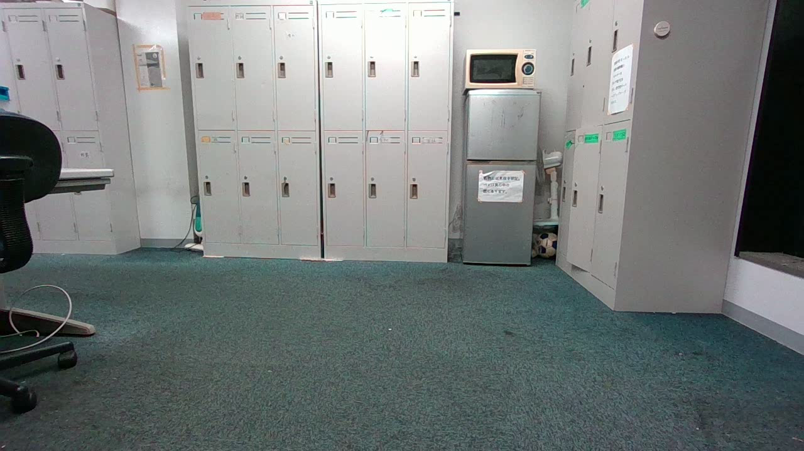

# ORB-SLAM 3 (Docker)

## How to build 

```
docker build . -t slam:orbslam3
```

## How to run 

```
docker run -it --privileged --net=host --ipc=host \
    -e "DISPLAY=$DISPLAY" \
    -e "QT_X11_NO_MITSHM=1" \
    -v "/tmp/.X11-unix:/tmp/.X11-unix:rw" \
    -e "XAUTHORITY=$XAUTH" \
    -v ~/thalamus:/data \
    slam:orbslam3

# Inside docker (RGBD)
./rgbd_tum ../../Vocabulary/ORBvoc.txt RealSense_D435i.yaml /data/rgbd_dataset_freiburg3_long_office_household associations/fr3_office.txt

```
# DataSet



link: https://drive.google.com/drive/folders/12PvTat2f8Fo_tNe0Y7skTtu2sygDyI3O
